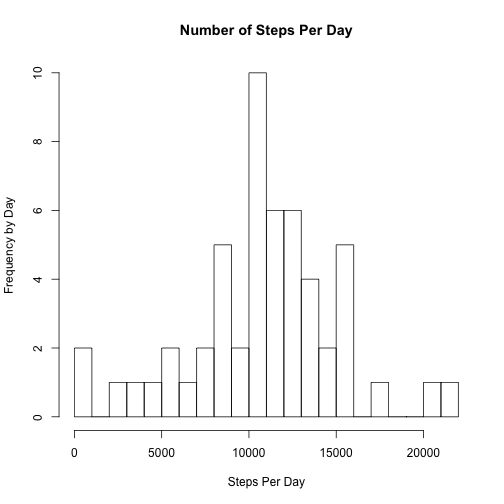
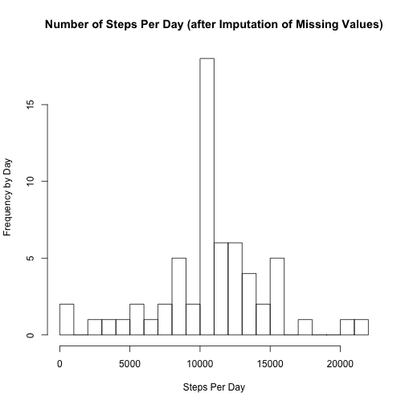
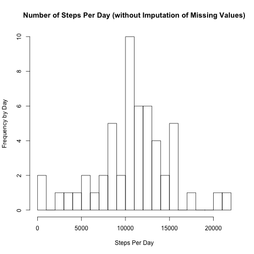

## Loading the Actitivy Monitor Data
The data to be analyzed consists of two months of data from an anonymous individual collected during the months of October and November 2012 and includes the number of steps taken in 5 minute intervals each day. The data is contained in a file named "activity.csv".

```r
dat <- read.csv('activity.csv', header = TRUE, stringsAsFactors = FALSE)
```
## Mean Total Number of Steps Taken Per Day
What is the mean total of steps taken per day by this individual? 

First of all, let's review the number of total steps taken each day. For purposes of this analysis we will ignore entries with missing values.

```r
completedat <- dat[complete.cases(dat),]
agg <- aggregate(steps ~ date, data = completedat, sum)
hist(agg[,'steps'], main = "Number of Steps Per Day", xlab = "Steps Per Day", ylab = "Frequency by Day", breaks = 20 )
```

 
    
Then we can calculate the mean of the total number of steps taken per day:

```r
stepsmean <- mean(agg[,'steps'])
roundmean <- format(round(stepsmean, 2), nsmall = 2)
```
  
The mean of the total number of steps taken per day is 10766.19. 
  
And we can calculate the median:

```r
stepsmedian <- median(agg[,'steps'])
```
  
The median of the total number of steps taken per day is 10765.  
  
## Average Daily Activity Pattern  
Make a time-series plot of the five-minute interval and the average number of steps taken, averaged across all days.

```r
agg <- aggregate(steps ~ interval, data = dat, mean)
plot(agg, type = 'l')
```

 
  
Which 5-minute interval, on average across all days in the dataset, contains the maximum number of steps?

```r
maxsteps <- agg[which.max(agg[,'steps']), 'interval']
```
  
The maximum number of steps, on average across all days in the dataset, occurs at interval 835.  

## Imputing Missing Values  

Calculate and report the total number of missing values in the dataset (i.e. the total number of rows with NAs)


```r
missing <- sum(is.na(dat))
```
There are 2304 missing values in the dataset.

Now to devise a strategy for filling in the missing values in the dataset. First of all, it becomes clear upon examining the activity monitor dataframe that missing values do not occur sporadically or in isolation, but in fact always span entire days. Therefore, a first step would be to determine how many days of missing values there are.


```r
navalues <- is.na(dat) ##determine rows with missing values
missingdat <- dat[navalues,] ##create new dataframe containing all rows with missing values
missingdays <- length(unique(missingdat[,'date'])) ##calculate total days with missing values
```

The total number of days with missing values is 8. This value, subtracted from the total number of unique dates in the activity monitor data frame, can be used to calculate an average number of steps for each interval across the original data frame.


```r
totaldays <- length(unique(dat[,'date'])) ##calculate total number of unique days in main data frame
days_with_values <- totaldays - missingdays ## subtract days with missing values from total days
```

The total number of days without missing values is 53. The average steps per interval can now be calculated by dividing each total number of steps per interval by this total number of days with values.  

```r
total_steps_per_interval <- aggregate(steps ~ interval, data = dat, sum) 
average_steps_per_interval <- total_steps_per_interval[,'steps']/days_with_values
average_steps_per_interval <- round(average_steps_per_interval, digits = 0) ## round the number to whole integers
```


A new dataset can now be calculated, replacing the missing values in the original dataset with these average steps per interval.

```r
average_steps_df <- as.data.frame(cbind(agg[,'interval'],average_steps_per_interval)) ##create df with intervals and average intervals
colnames(average_steps_df) <- c('interval','steps')
##ideally I would then add these values to each entry by interval but haven't figured out how to do so :|
##so will replace all na with daily average
stepsmean <- round(sum(average_steps_df$steps)/length(average_steps_df$interval), digits = 0)
newdat <- dat
newdat[is.na(newdat$steps),'steps'] <- stepsmean
```
  
Make a histogram of the total number of steps taken each day and calculate and report the mean and median total number of steps taken per day. 


```r
newagg <- aggregate(steps ~ date, data = newdat, sum)
hist(newagg[,'steps'], main = "Number of Steps Per Day (after Imputation of Missing Values)", xlab = "Steps Per Day", ylab = "Frequency by Day", breaks = 20 )
```

 

Compare this to the original histogram, with missing values.

```r
completedat <- dat[complete.cases(dat),]
agg <- aggregate(steps ~ date, data = completedat, sum)
hist(agg[,'steps'], main = "Number of Steps Per Day (without Imputation of Missing Values)", xlab = "Steps Per Day", ylab = "Frequency by Day", breaks = 20 )
```

 

Imputing the missing data clearly has an effect on the values, primarily increasing significantly the gap between the max value of steps during the day and the rest of the steps values.

##Are there differences in activity patterns between weekdays and weekends?

First create new columns in the dataset indicating weekdays, and whether a given date is a weekday or weekend.

```r
dat$date <- as.Date(dat$date)
dfweekdays <- weekdays(dat$date)
dat <- cbind(dat, dfweekdays)
head(dat)
```

```
##   steps       date interval dfweekdays
## 1    NA 2012-10-01        0     Monday
## 2    NA 2012-10-01        5     Monday
## 3    NA 2012-10-01       10     Monday
## 4    NA 2012-10-01       15     Monday
## 5    NA 2012-10-01       20     Monday
## 6    NA 2012-10-01       25     Monday
```

Apologies, got stuck on part 3 and was not able to complete this final part.
